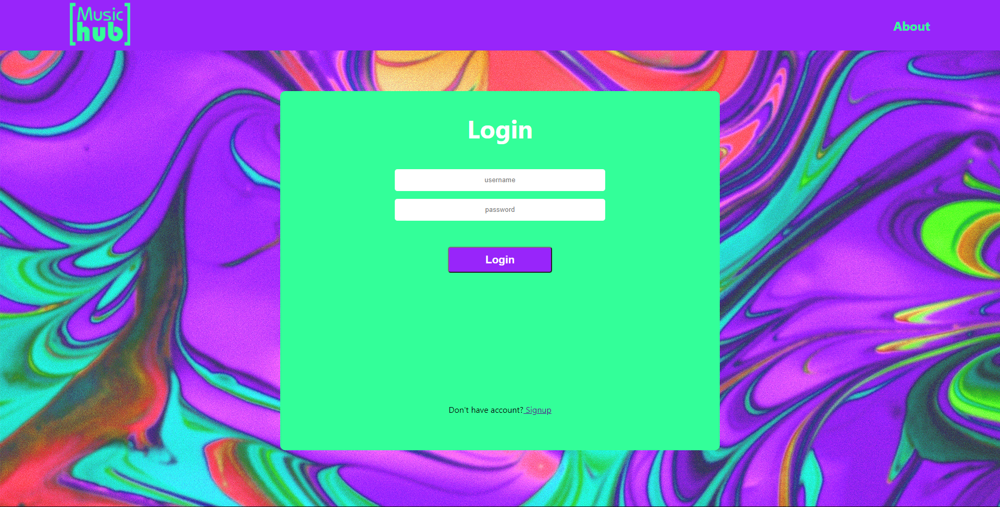

Welcome to musicHub 

 

an app that functions as a collaborative playlist.

You can create your playlist and invite people to it so that they can add songs, too.
No need to fight anymore whose device should be connected next to the speaker. With musicHub everyone that is invited to the paylist can add their song wishes.

Check it out:
https://music-hub-ironhack.netlify.app/

link to server repository:
https://github.com/South-Connection/music-hub-server

